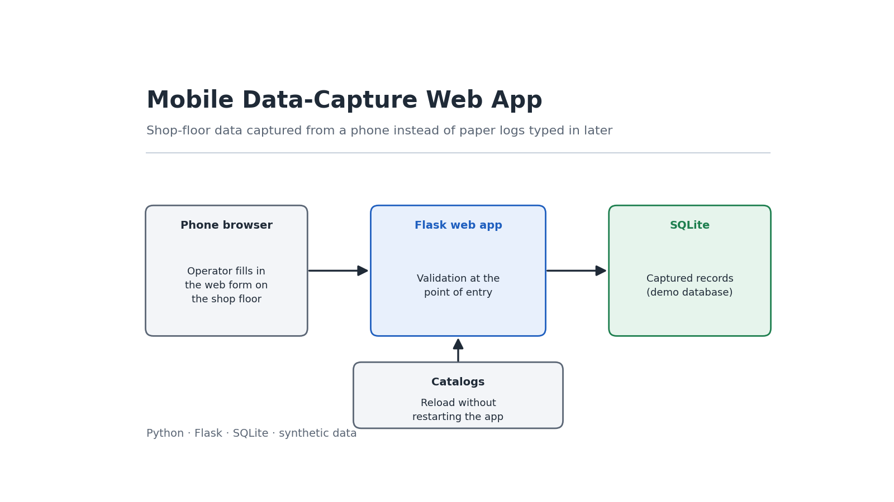

# Aplicación de captura de datos en planta



Formulario web para registro de producción por hora en máquinas pegadoras, usado desde el celular por los inspectores en piso. Reemplaza el registro en papel con digitación posterior por captura validada en el momento del evento.

Este repositorio es una **reimplementación demostrativa** de una de tres aplicaciones que desarrollé y opero en producción. El código aquí publicado es original, usa datos sintéticos y no contiene información de la empresa.

---

## El problema

El registro de producción se hacía en papel durante el turno y alguien lo digitaba después. Eso genera tres problemas encadenados:

- **Doble trabajo**: se escribe una vez a mano y otra en el computador.
- **Latencia**: entre que algo pasa en planta y que el dato existe pasan horas o días.
- **Errores sin corrección posible**: cuando el digitador encuentra una inconsistencia, el turno ya terminó y no hay a quién preguntarle.

Capturar en origen resuelve los tres. Pero introduce uno nuevo: el formulario tiene que funcionar en un celular, en planta, posiblemente con guantes, por alguien que tiene otras cosas que hacer.

## La decisión de diseño central

**El operario digita la lectura del contador de la máquina, no la producción de la hora.**

Parece un detalle y no lo es. Pedirle a alguien que reste mentalmente la lectura anterior cada hora, en planta y con prisa, es exactamente donde se cuelan los errores. Copiar un número de una pantalla no lo es.

El sistema calcula la producción restando lo ya registrado por ese operario, en esa orden y esa máquina, durante el día:

```
lectura del contador  8.200
ya registrado         5.000
                    ────────
producción de la hora 3.200
```

Al cambiar de operario, de orden o de turno el acumulado vuelve a cero, así que el siguiente registro se convierte en base nueva sin que nadie tenga que indicarlo.

El formulario muestra el cálculo **antes** de guardar. Sin eso, quien digita 12.400 no entiende por qué el historial muestra 800, y la desconfianza en el sistema es más costosa que cualquier error de digitación.

---

## Decisiones técnicas

**El lock de escritura no es decorativo.** Leer el acumulado y escribir el registro tienen que ser una sola operación atómica. Si dos inspectores guardan al mismo tiempo sobre la misma orden, ambos leerían el mismo acumulado y el segundo calcularía mal su producción.

**Los catálogos se recargan solos.** Un hilo demonio refresca órdenes, eventos y operarios cada hora. Cuando el ERP crea una orden nueva, aparece en el formulario sin reiniciar el servicio y sin que nadie tenga que entrar al servidor.

**Si la base falla, la app sigue sirviendo.** La recarga conserva los datos que ya estaban en memoria en lugar de vaciarlos. Una app de planta sin catálogos deja de funcionar por completo; una que trabaja con datos de hace una hora sigue siendo útil.

**Cabeceras anti-caché.** Esto dejó de ser teórico en producción: tras actualizar el formulario, los dispositivos seguían mostrando la versión anterior durante horas.

**El servidor no confía en el formulario.** El formulario valida por comodidad del usuario; el servidor valida porque es la única garantía real. Se verifica que la orden exista y esté activa, que la máquina sea válida y que los campos obligatorios vengan completos.

**Endpoints de diagnóstico.** `/api/estado` reporta cuándo se cargaron los catálogos y cuántos registros hay; `/api/recargar` fuerza un refresco. Permiten verificar el servicio sin entrar al servidor, que en planta es la diferencia entre resolver algo en un minuto o en media hora.

---

## Diseño de la interfaz

El contexto de uso manda sobre cualquier preferencia estética:

- Objetivos táctiles de 56px mínimo, porque se opera con guantes
- Contraste alto, porque la luz de planta es irregular
- La lectura del contador en tipografía grande y tabular, para que un error de digitación se note antes de guardar
- El campo de cantidad desaparece cuando el evento no es de tiraje, porque un paro no produce unidades
- Los avisos dicen qué pasó y qué hacer, no piden disculpas

---

## Ejecución

Requiere Python 3.10 o superior.

```bash
pip install -r requirements.txt

python datos_demo.py   # crea planta.db con catálogos de ejemplo
python app.py          # servidor en http://localhost:5000
```

Para probarlo desde el celular, con ambos dispositivos en la misma red, se entra a `http://<ip-del-equipo>:5000`.

Flujo de prueba: selecciona una máquina, escribe una orden del catálogo (`OP-2601` en adelante), elige operario y evento de tiraje, y digita una lectura. Guarda, y luego digita una lectura mayor: el segundo registro mostrará solo la diferencia.

---

## Estructura

| Archivo | Contenido |
|---|---|
| `app.py` | Rutas, validación de servidor, cabeceras anti-caché |
| `data_manager.py` | Catálogos en memoria, recarga en caliente, cálculo de producción |
| `datos_demo.py` | Genera la base con catálogos de ejemplo |
| `templates/form.html` | Formulario móvil |

---

## Diferencias con la versión en producción

| | Aquí | Producción |
|---|---|---|
| Órdenes | SQLite local | SQL Server, alimentado por el pipeline del ERP |
| Eventos y operarios | SQLite local | maestras en Excel mantenidas por calidad |
| Destino | SQLite | consolidado en Excel sobre carpeta de red |
| Autenticación | selector de operario | validación por cédula contra la maestra |
| Despliegue | manual | servicio en equipo de planta, arranque automático |

Es una de tres aplicaciones hermanas con la misma arquitectura, cada una para un proceso distinto de la planta.

---

## Posibles extensiones

- Cola local para registrar sin conexión y sincronizar al recuperar la red
- Alerta cuando una lectura es menor que el acumulado, que indica cambio de contador o error de digitación
- Cierre de turno con resumen por operario

---

## Licencia

MIT
